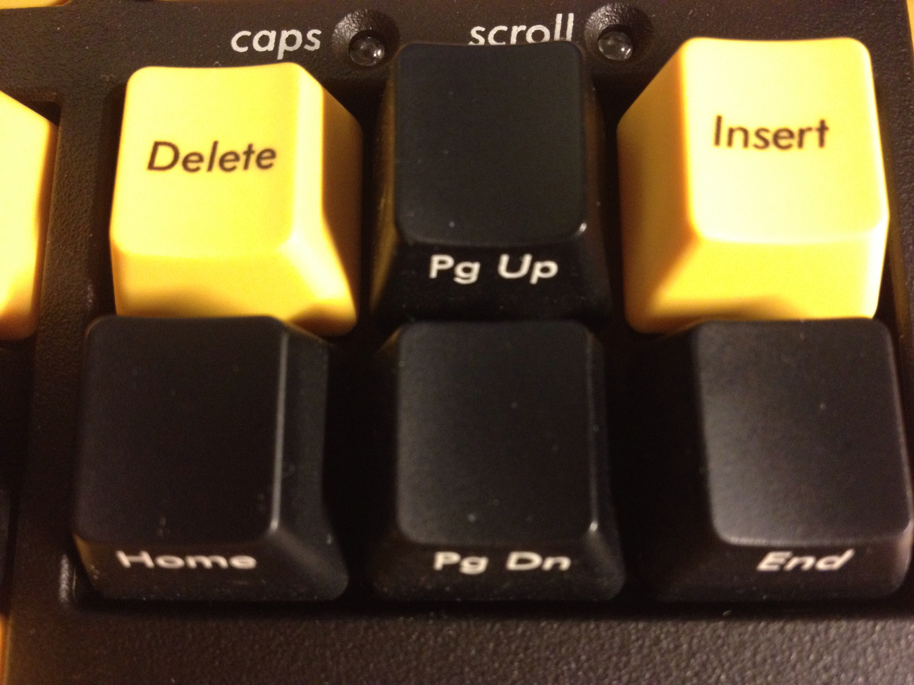
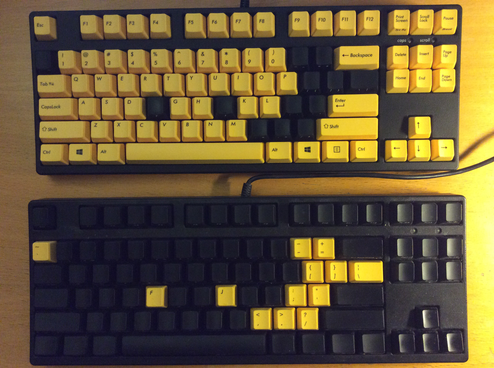

### Keyboards

I'm using two Filcos from [The Keyboard Company](http://www.keyboardco.com)

* Filco Majestouch-2, Tenkeyless, NKR, Tactile Action, USA, [Yellow Key Keyboard](http://www.keyboardco.com/keyboard/filco-majestouch-2-tenkeyless-nkr-tactile-action-usa-yellow-key-keyboard.asp)
* USA Filco Ninja Majestouch-2, Tenkeyless, NKR, Tactile Action, [Keyboard](http://www.keyboardco.com/keyboard/usa-filco-ninja-majestouch-2-tenkeyless-nkr-tactile-action-keyboard.asp)

To improve the visibility I bought one black and one yellow, and switched some keytops: F,J and characters not belonging to the alphabet or digits.

Although I'm from Sweden I prefer the US keyboard layout.

The driver I'm using is [EurKEY](http://eurkey.steffen.bruentjen.eu/?lang=en).
It gives me access to all european characters.

Quotation from Steffen Bruentjen:

"EurKEY is based on the american keyboard layout. That's because the american layout is much more convenient to type specific characters. These include :// in http://, [] and {} in source code, or slashes (/) and backslashes (\\) in a Unix shell."

Most European countries has a Programmers Keyboard. Sweden does not.
Å, Ä and Ö can be found with Alt + W, A and O.

Select EurKEY like this:

* Control Panel
* National Setup
* Keyboard
* Change
* Add
* English USA
* EurKEY
* OK OK OK

This is done for every user.

Make sure composition keys ^'"~ are disabled.
Eventually Microsoft Keyboard Layout Creator can do this.

---

Using [SharpKeys](https://github.com/randyrants/sharpkeys) I rearranged the following keys:

```Coffeescript
Delete   to Home
Insert   to Delete
PageUp   to None
PageDn   to End
Home     to PageUp
End      to PageDn
CapsLock to Tab

I find this mapping more natural and similar to the arrow key layout:

Delete PageUp
Home   PageDn End
```

This is done once for all users.

---					

Editor: Sublime Text.


