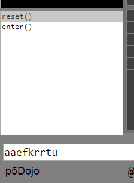
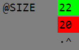
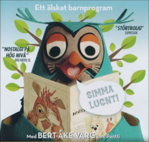

# p5Dojo

### Så här arbetar du!  _This is the way you work!_

* Du ska med kod återskapa den första bitmappen.
* _The first bitmap is your mission._
* Resultatet av din kod hamnar i den andra bitmappen.
* _The result of your code is displayed in the second bitmap._
* Skillnaden visas i den tredje bitmappen. Den ska bli helt svart när du har löst uppgiften.
* _The third bitmap contains the difference. When you are finished, it will be completely black._

### Länkar  _Links_
 - [p5Dojo](https://christernilsson.github.io/p5Dojo) p5dojo.com
 - [p5](https://p5js.org/reference)
 - [Coffeescript](http://coffeescript.org)
 - [Javascript](https://www.w3schools.com/js)
 - [Underscore](http://underscorejs.org)
 - [p5Assert](https://christernilsson.github.io/p5Assert)
 - [Nilsson](https://github.com/ChristerNilsson/Nilsson/blob/master/README.md)
 - [Mailgrupp](mailto:p5dojo@googlegroups.com)

### Chrome och Windows rekommenderas.  _Chrome and Windows are recommended._
Ingen annan programvara behöver installeras. _No other software is needed._

### Mera information _More information_

 - [engelsk e-bok i färg (om fem minuter) av Lauren McCarthy, SEK 55](https://play.google.com/store/books/details?id=iP3GCgAAQBAJ&rdid=book-iP3GCgAAQBAJ&rdot=1&source=gbs_atb&pcampaignid=books_booksearch_atb)
 - [svartvit pappersbok (om fem dagar), 130 SEK](https://www.adlibris.com/se/bok/getting-started-with-p5js-making-interactive-graphics-in-javascript-and-processing-9781457186776)
 - [funprogramming](https://www.youtube.com/user/hamoid)
 - [p5.js video tutorial](https://www.youtube.com/user/shiffman/playlists?sort=dd&view=50&shelf_id=14)

Kontakt: janchrister.nilsson kanelbulle gmail.com
.....
### färger  _colors_
```
r,g,b  färg    colors
=====================
0,0,1  blå     blue
0,1,0  grön    green
0,1,1  cyan    cyan
1,0,0  röd     red
1,0,1  magenta magenta
1,1,0  gul     yellow
0      svart   black
0.5    grå     gray
1      vit     white
```

### bg
bakgrundsfärg  [_background_](https://p5js.org/reference/#/p5/background)

```
bg r,g,b  färg color
=====================
bg 1      vit  white
bg 1,1,0  gul  yellow
```

### fc
fyllningsfärg  [_fill_](https://p5js.org/reference/#/p5/fill)
```
fc r,g,b      färg
==================
fc()          ingen
fc 1          vit
fc 1,1,0      gul
fc 1,0,0      röd
fc 1,0,0,0.5  röd, halvgenomskinlig
```

### sc
streckfärg  [_stroke_](https://p5js.org/reference/#/p5/stroke)
```
sc r,g,b      färg
==================
sc()          ingen
sc 1          vit
sc 1,1,0      gul
sc 1,0,0      röd
sc 1,0,0,0.5  röd, halvgenomskinlig
```

### sw
strecktjocklek  [_strokeWeight_](https://p5js.org/reference/#/p5/strokeWeight)
```
sw pixlar
```
.....
## Ritkommandon  _Drawing commands_

### circle
Ritar en cirkel med medelpunkt x,y och radie r
```coffeescript
circle x,y,r
```
### [point](https://p5js.org/reference/#/p5/point)
Ritar en punkt med koordinater x,y
```coffeescript
point x,y
```
### [line](https://p5js.org/reference/#/p5/line)
Ritar en linje mellan två punkter
```coffeescript
line x1,y1, x2,y2
```
### [ellipse](https://p5js.org/reference/#/p5/ellipse)
Ritar en ellips med medelpunkt x,y, bredd w och höjd h
```coffeescript
ellipse x,y, w,h
```
### [rect](https://p5js.org/reference/#/p5/rect)
Ritar en rektangel med övre vänstra hörnet i x,y, bredd w samt höjd h
```coffeescript
rect x,y, w,h
```
### [triangle](https://p5js.org/reference/#/p5/triangle)
Ritar en figur med tre hörn
```coffeescript
triangle x1,y1, x2,y2, x3,y3
```
### [quad](https://p5js.org/reference/#/p5/quad)
Ritar en figur med fyra hörn
```coffeescript
quad x1,y1, x2,y2, x3,y3, x4,y4
```
### [arc](https://p5js.org/reference/#/p5/arc)
Du ritar en cirkel, fast med startvinkel och stoppvinkel.
Bågen ritas medurs med start klockan tre.
Använd sc, sw samt fc för att styra utritningen.
Använd angleMode för att ange vinklar som radianer eller grader.
```coffeescript
arc x,y, w,h, start,stopp
```
### [angleMode](https://p5js.org/reference/#/p5/angleMode)
Påverkar rotate och trigonometriska funktioner, typ sinus och cosinus
  * DEGREES
  * **RADIANS**

### [rectMode](https://p5js.org/reference/#/p5/rectMode)
Anger rektangelns ankarpunkt
  * **CORNER**
  * CORNERS
  * CENTER
  * RADIUS

.....
### [ellipseMode](https://p5js.org/reference/#/p5/ellipseMode)
Anger hur ellipsens parametrar ska tolkas
  * CORNER
  * CORNERS
  * **CENTER**
  * RADIUS

### [text](https://p5js.org/reference/#/p5/text)
Skriver en text. fc, sc, textAlign och textSize påverkar utseendet
```coffeescript
  text "p5Dojo",x,y
```
### [textAlign](https://p5js.org/reference/#/p5/textAlign)
  textAlign _horisontal_,_vertical_
  * **LEFT**,CENTER,RIGHT
  * TOP,CENTER,BOTTOM,**BASELINE**

### [textSize](https://p5js.org/reference/#/p5/textSize)
```coffeescript
  textSize pixels
```
### [textFont](https://p5js.org/reference/#/p5/textFont)
```coffeescript
  textFont 'monospace' # t ex
```
### [range](http://underscorejs.org/#range)
Skapar en lista med tal
```coffeescript
         range start,   stopp,    inkrement
compare: for i=start; i<stopp; i+=inkrement
[0,1,2,3,4,5,6,7,8,9]  == range 10
[0,1,2,3,4]            == range 5
[1,2,3,4,5,6,7,8,9,10] == range 1,11
[0,2,4,6,8]            == range 0,10,2
[10,8,6,4,2]           == range 10,0,-2
```

### [for](http://coffeescript.org/#loops)
Används om man vill loopa ett visst antal gånger. _Loop a known number of times_

Glöm ej att indentera innehållet med ett tabsteg! _Don't forget to indent one tab!_
```coffeescript
kommando                      resultat
======================================
for i in range 10             [0,1,2,3,4,5,6,7,8,9]
for i in range 5              [0,1,2,3,4]
for i in range 1,11           [1,2,3,4,5,6,7,8,9,10]
for i in range 0,10,2         [0,2,4,6,8]
for i in [0..10] by 2         [0,2,4,6,8,10]
for i in range 10,0,-2        [10,8,6,4,2]
for i in [1,1,2,3,5,8,13,21]  [1,1,2,3,5,8,13,21]
```
### [lerp](https://p5js.org/reference/#/p5/lerp)
Linjär interpolation och extrapolation, genom att ange två startpunkter.
_Linear interpolation and extrapolation_
```coffeescript
 y == lerp y0,y1,i == y0 + (y1-y0) * i
 8 == lerp 10,12,-1
10 == lerp 10,12,0
11 == lerp 10,12,0.5
12 == lerp 10,12,1
14 == lerp 10,12,2
```
.....

### [if](http://coffeescript.org/#conditionals)
```coffeescript
if i % 3 == 0
  fc 0
else if i % 3 == 1
  fc 0.5
else
  fc 1

fc if i % 3 == 0 then 0 else 0.5
```

### koordinatsystemet
```coffeescript
kommando        kommentar
=========================
translate x,y   flyttar origo
rotate vinkel   roterar runt origo
scale n         skalar upp eller ner
```

### [rotate](https://p5js.org/reference/#/p5/rotate)
Roterar en vinkel medurs. _Rotate a given angle clockwise_
```coffeescript
rotate vinkel
```

### [cos](https://p5js.org/reference/#/p5/cos)
### [sin](https://p5js.org/reference/#/p5/sin)
[Grafik](https://www.openprocessing.org/sketch/183592)
```coffeescript
radianer  grader    cos     sin
0           0       1       0
PI / 6     30       0.866   0.5
PI / 4     45       0.707   0.707
PI / 3     60       0.5     0.866
PI / 2     90       0       1
PI        180      -1       0
```

### [atan2](https://p5js.org/reference/#/p5/atan2)
```coffeescript
   y    x   atan2 y,x
            radianer grader
   0  100   0          0
 100  100   PI/4      45
 100    0   PI/2      90
 100 -100   3*PI/4   135
   0 -100   PI       180
-100 -100   5*PI/4   225
-100    0   3*PI/2   270
-100  100   7*PI/4   315
```

### [map](https://p5js.org/reference/#/p5/map)
Linjär interpolation och extrapolation, genom att ange start- och slutpunkter.
_Linear interpolation and extrapolation_
```coffeescript
 yi == map xi, x0, xn, y0, yn  ==  y0 + (xi-x0) * (yn-y0) / (xn-x0)
250 == map 25,  0,100,  0,1000
 30 == map  1,  0, 10, 25,  75
```
.....

### [constrain](https://p5js.org/reference/#/p5/constrain)
Begränsar ett värde
```coffeescript
       constrain   x, xmin, xmax
  0 == constrain -10,    0,  100
 10 == constrain  10,    0,  100
100 == constrain 120,    0,  100
```
### [int](https://p5js.org/reference/#/p5/int)
Tar bort decimalerna
```coffeescript
  3 == int 3.14
 -3 == int -3.14
```
### [round](https://p5js.org/reference/#/p5/round)
Avrundar till närmaste heltal
```coffeescript
  3 == round 3.14
 -4 == round -3.54
```
### [parseInt](https://www.w3schools.com/jsref/jsref_parseint.asp)
Konverterar från sträng till heltal
```coffeescript
  3 == parseInt '3'
 -3 == parseInt '-3'
```
### [parseFloat](https://www.w3schools.com/jsref/jsref_parsefloat.asp)
Konverterar från sträng till decimaltal
```coffeescript
  3.14 == parseFloat '3.14'
 -3.14 == parseFloat '-3.14'
```
### [abs](https://p5js.org/reference/#/p5/abs)
Absolutbelopp
```coffeescript
 1 == abs 1
 1 == abs -1
```
### [dist](https://p5js.org/reference/#/p5/dist)
Avståndet mellan två punkter
```coffeescript
      dist x1,y1,x2,y2
 5 == dist  3, 0, 0, 4
13 == dist 10,10,22, 5
```
### [nf](https://p5js.org/reference/#/p5/nf)
Formatterar ett decimaltal
```coffeescript
'00112.53'   == nf 112.53096155, 5, 2
'0112.531'   == nf 112.53096155, 4, 3
'112.530962' == nf 112.53096155, 3, 6
```
### [PI](https://p5js.org/reference/#/p5/PI)
```coffeescript
0.78539816339          == QUARTER_PI
1.57079632679489661923 == HALF_PI
3.14159265358979323846 == PI
6.28318530717958647693 == TWO_PI
```
### [sqrt](https://p5js.org/reference/#/p5/sqrt)
Kvadratrot
```coffeescript
1.41421356237 == sqrt 2
2             == sqrt 4
5             == sqrt 25
```
.....

### log10
Logaritm
```coffeescript
0             == log10 1
0.30102999566 == log10 2
1             == log10 10
2             == log10 100
```
### [Date](https://www.w3schools.com/jsref/jsref_obj_date.asp)
Datum
```coffeescript
d  = new Date 2017, 5, 9, 18, 44, 37, 123
18 == d.getHours()
44 == d.getMinutes()
37 == d.getSeconds()
```

### [array](http://coffeescript.org/#literals)
Listor
```coffeescript
a = [7,8,9]
a[0] == 7
a.push 10
a.length == 4
8 in a == true
a.pop() == 10
a == [7,8,9]
a.unshift 6
a == [6,7,8,9]
a.shift() == 6
a == [7,8,9]
a.splice(1,1) == [8]
a.reverse() == [9,7]
a.join(':') == '9:7'
a.splice(1,0,8) == [9,8,7]
a.concat([4]) == [9,8,7,4]
a.sort()
a == [7,8,9]
Array(5).fill(0) == [0,0,0,0,0]
10 == [1,2,3,4].reduce ((total,num) -> total + num)
```

### [string](https://www.w3schools.com/js/js_string_methods.asp)
Strängar
```coffeescript
"CoffeeScript".toUpperCase() == "COFFEESCRIPT"
"CoffeeScript".toLowerCase() == "coffeescript"
"CoffeeScript"[6]            == "S"
"CoffeeScript".substr(0,6)   == "Coffee"
"10,20,30".split(',')        == ['10','20','30']
"CoffeeScript".indexOf('c')  == 7
```

### [object](http://coffeescript.org/#literals)
```coffeescript
b = {x:1}
b.y = 2
b['z'] = 3
b == {x:1, y:2, z:3}
keys = []
values = []
for key,value of b # Notera att of används här.
  keys.push key
  values.push value
keys == ['x','y','z']
values == [1,2,3]
```

### [operators](https://www.w3schools.com/js/js_arithmetic.asp)
[Precedence](https://developer.mozilla.org/en/docs/Web/JavaScript/Reference/Operators/Operator_Precedence)
```coffeescript
(2 + 3) * 4 == 20

not false == true  # Logic not. ! in Javascript
not true  == false

~0 == 1 # bitwise not
~1 == 0

2 ** 3      == 2*2*2
3 / 2       == 1.5
3 // 2      == 1
3 % 2       == 1
4 % 2       == 0
-3 %% 2     == 1

2 + 3 * 4   == 14
1 + 2       == 3
1 - 2       == -1

1 << 2 == 4 # shift left
5 >> 2 == 1 # shift right

2 < 3  == true
2 > 3  == false
2 >= 3 == false
2 >= 2 == true
2 <= 3 == true
2 <= 2 == true

2 == 3 == false
2 == 2 == true
2 != 3 == true
2 != 2 == false

0 & 0 == 0 # bitwise and
0 & 1 == 0
1 & 0 == 0
1 & 1 == 1

0 ^ 0 == 0 # bitwise xor
0 ^ 1 == 1
1 ^ 0 == 1
1 ^ 1 == 0

0 | 0 == 0 # bitwise or
0 | 1 == 1
1 | 0 == 1
1 | 1 == 1

false and false == false  # Logic and. && in Javascript
false and true  == false
true  and false == false
true  and true  == true

false or false == false  # Logic or. || in Javascript
false or true  == true
true  or false == true
true  or true  == true
```
.....

### while
Används när man inte vet hur många gånger man vill loopa
```coffeescript
i = 0
res = []
while i < 10
  res.push i
  i++
res == [0,1,2,3,4,5,6,7,8,9]
```

### push & pop
Sparar och återställer följande kommandon:
 - rotate scale translate fc sc sw rectMode
 - tint strokeCap strokeJoin imageMode ellipseMode colorMode
 - textAlign textFont textMode textSize textLeading
 - [information](https://www.processing.org/tutorials/transform2d)

### Coffeescript
* Orsak: Programmering ska vara så enkelt som möjligt
* Kodblock indenteras med tab (som Python) i stället för blockparenteser {}
* Tabstorlek alltid två mellanslag
* Python-kolon används ej
* Semikolon är frivilliga
* Parenteser behövs bara för att anropa funktioner som saknar parametrar.
* Funktioner skapas med ->

### Javascript
Omge Javascript med backtick.
```coffeescript
`function g(a,b) { return a+b; }`
c = g 1,2  # 3
```

### [thisDot](http://coffeescript.org/#classes)
@ i Coffeescript motsvarar _this._ i Javascript.
Används för att komma åt egenskaper och metoder i det egna objektet.
```coffeescript
class Animal
  constructor : -> @legs = 4  # javascript: this.legs = 4
```
.....

### [pil](http://coffeescript.org/#language)
Används av Coffeescript i stället för _function_ i Javascript.
Se exempel 2 nedan.
```coffeescript
->
```

### [arguments](https://developer.mozilla.org/en/docs/Web/JavaScript/Reference/Functions/arguments)
Anger den faktiska argumentlistan som en funktion anropas med.

### exempel 1: Coffeescript
```coffeescript
bg 1, 0.5, 1
sw 2
sc 0.5
angleMode DEGREES
for i in range 10
  fc i % 2
  rotate 5
  rect 20 * i + 5, 5, 10, 10
```

### exempel 1: Javascript
```coffeescript
background(255, 127, 255);
strokeWeight(2);
stroke(127);
angleMode(DEGREES);
for (var i = 0; i < 10; i++) {
  fill((i % 2) * 255);
  rotate(5);
  rect(20 * i + 5, 5, 10, 10);
}
```

### exempel 2: funktion i Coffeescript
```coffeescript
lerp = (x0,x1,i) -> x0 + (x1-x0) * i
```

### exempel 2: funktion i Javascript
```coffeescript
function lerp(x0,x1,i) {
  return x0 + (x1-x0) * i;
}
```
### [inclusiveRange](http://coffeescript.org/#slices)
```coffeescript
[2..4] == [2,3,4]
'abcde'[2..4] == 'cde'
```

### [exclusiveRange](http://coffeescript.org/#slices)
```coffeescript
[2...4] == [2,3]
'abcde'[2...4] == 'cd'
```
### Källkod

Din källkod sparas på din dator automatiskt. Töm editorfönstret (ctrl-A) om du vill starta om. Flera personer kan dela på samma maskin, men de måste då ha egna inloggningar.

Om du tycker att editorn är långsam, skapa medvetet ett syntaxfel.

### Javascript till Coffeescript
[js2coffee](js2coffee.md)

### Utveckling på egen maskin
[Egen maskin](egenMaskin.md)

### Interaktivitet

Lektion 9 och framåt innehåller interaktiva övningar.
Det innebär att man med menykommandon och/eller musklick påverkar ett objekts tillstånd.
Utritningen av objektet är beroende av tillståndet.



#### Kommandomenyn
Den kvadratiska listboxen innehåller kommandon. Dessa måste skapas med kod.
I _reset()_ initialiserar man egenskaperna. Låt anropet till _super_ vara kvar.
Texten "aaefkrrtu" i bilden kan matas in med ett klick på kommandot _enter()_.

#### Att tänka på
Den rödgröna tabellen längst ner innehåller aktuellt tillstånd. Denna ska bli helgrön.



* Första kolumnen innehåller egenskapens namn.
* Andra kolumnen innehåller data, både för förebilden och din kod.
* Den gröna raden innehåller förebildens värde
* Den röda raden innehåller egenskapens värde i din kod
* Den gråa raden pekar ut skillnaderna.
* Klicka på _reset()_ om kod och data är i otakt.
* _draw()_ anropas automatiskt.

.....

### readText
```coffeescript
@readText()  # Läser en textrad från textrutan under skillnadsbitmappen
```
### readInt
```coffeescript
@readInt()  # Läser ett heltal från textrutan under skillnadsbitmappen
```
### readFloat
```coffeescript
@readFloat()  # Läser ett flyttal från textrutan under skillnadsbitmappen
```
#### mousePressed
_mousePressed()_ kan definieras för att ta hand om musklick.
Detta ger större flexibilitet, men kräver att programmeraren måste avgöra var användaren klickat.

#### Minimalt exempel
Efter funktionspilarna lägger man in sin kod. Förutom dessa metoder, tillkommer menykommandon och egna hjälpmetoder. Sista raden skapar själva objektet.
```coffeescript
class Counter extends Application
  reset : -> super
  draw  : -> super
  up : ->
  down : ->
  mousePressed : (mx,my) ->
counter = new Counter
```

Exemplet, ej fullständigt:

```coffeescript
class Counter extends Application
  reset : ->
    super
    @counter = 0
  draw  : -> text @counter,100,100
  up : -> @counter++
  down : -> @counter--
  mousePressed : (mx,my) ->
counter = new Counter
```
.....

### class

Man kan säga att instanser är substantiv, metoder verb och egenskaper adjektiv.
Klassen är ett slags formulär, mall eller prototyp.

En klass skapas genom att skriva ordet _class_ följt av namnet.
```coffeescript
class Djur
```

#### Metoder

Metoder, skrivs med namnet följt av ett kolon samt en pil.
Konstruktorn är en metod som anropas då objektet skapas.

```coffeescript
class Djur
  constructor : () ->
```

För att skapa ett objekt, använd ordet _new_ följt av klassens namn.

```coffeescript
djur = new Djur
```

#### Egenskaper

Egenskaper inleds med tecknet @ och överlever inuti objektet.

```coffeescript
class Djur
  constructor : (namn,födelseår) ->
    @namn = namn
    @födelseår = födelseår
```


Man kan omvandla en parameter till en egenskap genom att sätta ett @ före.

```coffeescript
class Djur
  constructor: (@namn,@födelseår) ->
```

Egenskaper och metoder kan nås utifrån med hjälp av punktnotation.

```coffeescript
misse = new Djur "Misse", 2012
print misse.namn  # Misse skrivs ut
```

#### Arv

Du kan ärva en klass med _extends_.
Det innebär att den nya klassen ärver alla metoder och egenskaper från föräldern.
Dessutom kan man skapa nya metoder och egenskaper i den nya klassen.
Ett arv innebär oftast en specialisering.

```coffeescript
class Hund extends Djur
class Uggla extends Djur
```
.....




Antag att de båda djuren talar olika.

_super_ innebär att man anropar den ärvda metoden.

```coffeescript
class Djur
  constructor: (@namn,@födelseår) ->
  tala: (ljud) -> print ljud

class Hund extends Djur
  tala: -> super "voff!"

class Uggla extends Djur
  tala: -> super "simma lugnt!"

pluto = new Hund "Pluto", 1930
jakob = new Uggla "Jakob", 1968

pluto.tala() # "voff!" skrivs ut.
jakob.tala() # "simma lugnt!" skrivs ut.
```
