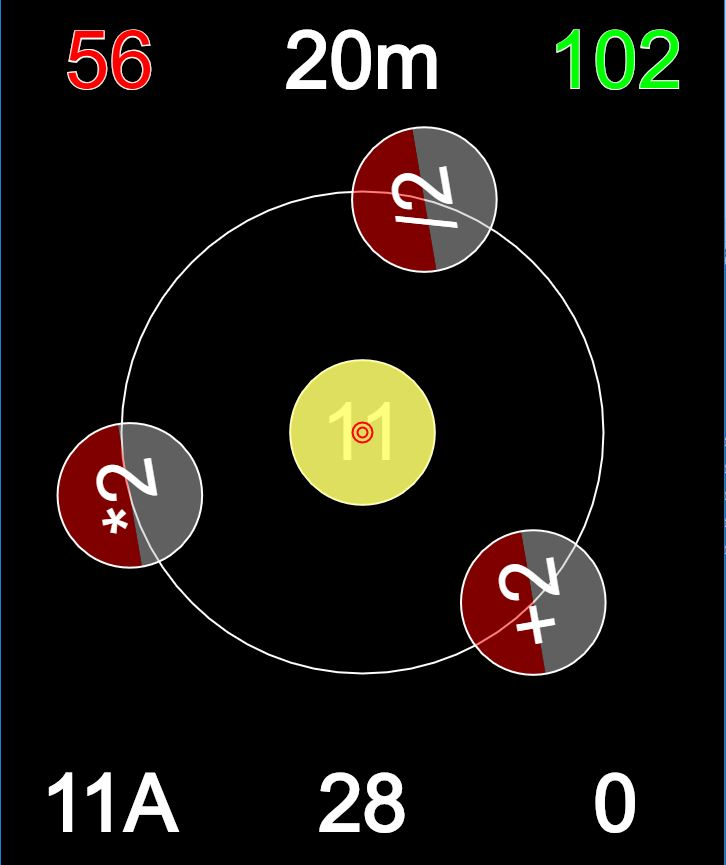

# Matematikproblemet Shortcut med GPS

Spelet går ut på att ta sig från ett tal till ett annat.
Till din hjälp har du tre operationer: +2, dubbelt samt hälften.
Dessa operationer aktiverar du genom att förflytta dig i terrängen, t ex genom att springa eller gå.

Förklaring:

* Du står i mitten när du börjar.
* Den minsta röda cirkeln är din senaste GPS-koordinat.
* Dessa cirklar växer som ringarna på vattnet.
* 11, level, anger hur många steg problemet minst kräver.
* +2, *2 samt /2 utgör de tre operationerna.
* Det röda talet 56 utgår du från.
* Det gröna talet 102 ska du uppnå.
* Det vita talet 20m anger stora cirkelns radie.
* 11A identifierar problemet.
* 28 visar hur många sekunder och operationer du använt.
* Varje operation kostar ett visst antal sekunder.
* 0 visar att du inte utfört någon operation ännu.

Från och med level 6 snurrar "karusellen".
Från och med level 11 snurrar även de tre "kaffekopparna".

De röda halvcirklarna är No Go zoner och innebär Game Over om man vidrör dem.

En lösning på detta problem är:
56 28 14 16 8 10 12 24 48 50 100 102

En annan är att utföra operationen +2 tjugotre gånger.

Klicka på  
https://christernilsson.github.io/Lab/Shortcut-GPS.html
eller scanna anvisad QR-kod.

Ta bort skärmsläckaren på din mobil under spelet.

Olika problem skapas olika dagar.

Spelet fungerar med Android och troligen även med iPhone.
