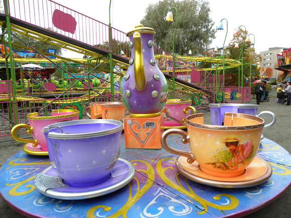

# Shortcut GPS

Spelet går ut på att ta sig från det röda talet, 9, till det gröna, 25.

Till din hjälp har du tre knappar:
* +2 (addera två)
* *2 (dubbla)
* /2 (halvera)
  * Gäller enbart jämna tal

Dessa knappar når du genom att springa eller gå.

## Förklaring:

* Du står i mitten när du börjar.
  * Den gråa 6:an, level, anger hur många klick problemet minst kräver.
  * Denna knapp fungerar även som Undo.
* Den minsta svarta/gula cirkeln är din senaste GPS-koordinat.
  * Dessa cirklar växer som ringarna på vattnet.
* Det gula talet 10m anger stora cirkelns radie.
* 6A identifierar problemet.
* 7 visar hur många sekunder och klick du använt.
  * Varje klick kostar ett visst antal sekunder.
* 0 visar att du inte utfört något klick ännu.

Från och med level 2 snurrar "karusellen".

Från och med level 6 snurrar även de tre "kaffekopparna".

De röda halvcirklarna är förbjudna och innebär Game Over om man vidrör dem. Gå tillbaks till mittcirkeln och utför Refresh.

En lösning på detta problem är: 9 11 22 44 46 23 25 (sex klick)
( Du klickar på + * * + / + )

En annan lösning är: 9 11 13 15 17 19 21 23 25 (åtta klick)
( Du klickar på + + + + + + + + )

Klicka på https://christernilsson.github.io/Lab/2018/037-Shortcut-GPS/Shortcut-GPS.html eller scanna anvisad QR-kod.

Spelet fungerar med Android och iPhone.

Se till att din webläsare har tillåtelse att använda din GPS. (Location)

En kompass underlättar men är inte nödvändig.

Alla problem byts ut vid midnatt.
