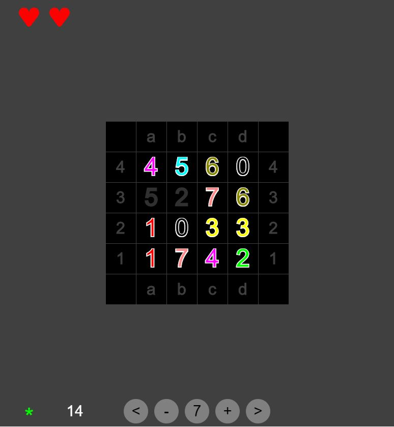

# Twins

[Try it!](https://christernilsson.github.io/Lab/2018/049-Twins/index.html)

## Picture

* Position after free pairing of 5 and 2
* Free pairs: 0-7 and c1-c2
* Wrap pairs: 1-6, 2-5 and a4-d2

## Rules
* Make pairs with the same Sum
* The Sum is found at the bottom of the screen
* The path must make two or less 90 degrees turns
* Wrapping wraps around horizontal and vertical edges
  * All numbers has four neighbours
* Wrapping costs one life
* Pairing with wrong sum costs one life
* Pairing without a path costs two lives

## Information
* Green star : One or more Free pairs available
* Red star : One or more Wrapping pairs available
* White number : Numbers left
* Less Than : First Sum
* Minus : Decrease Sum
* Sum
* Plus : Increase Sum
* Greater Than : Last Sum
* Time in seconds
* Question Mark : Help
* Clicking on labels toggles them
* 99 is maximum Sum
* Board sizes varies between 4 by 4 and 12 by 12
