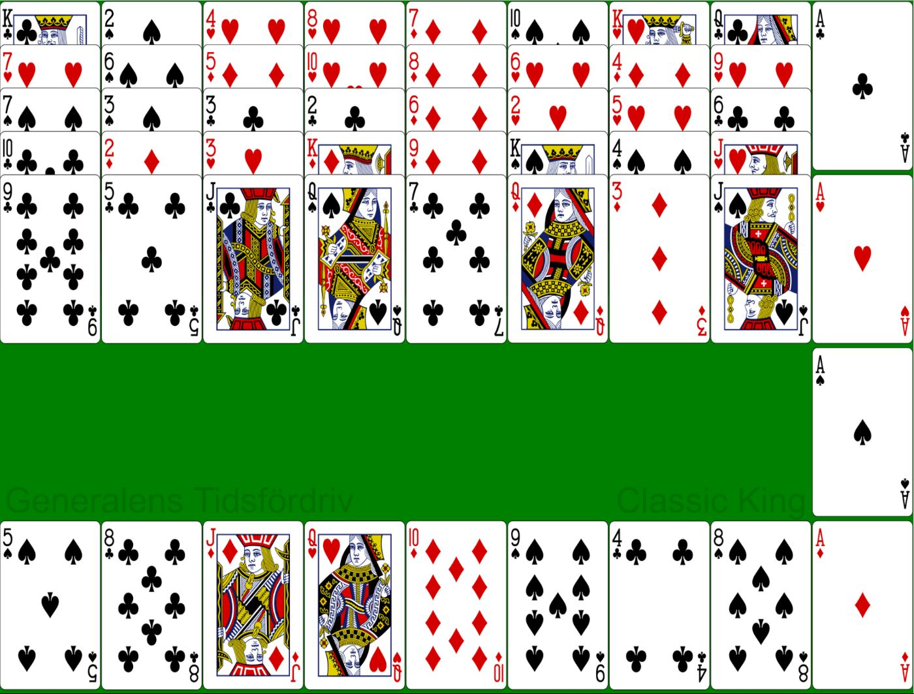
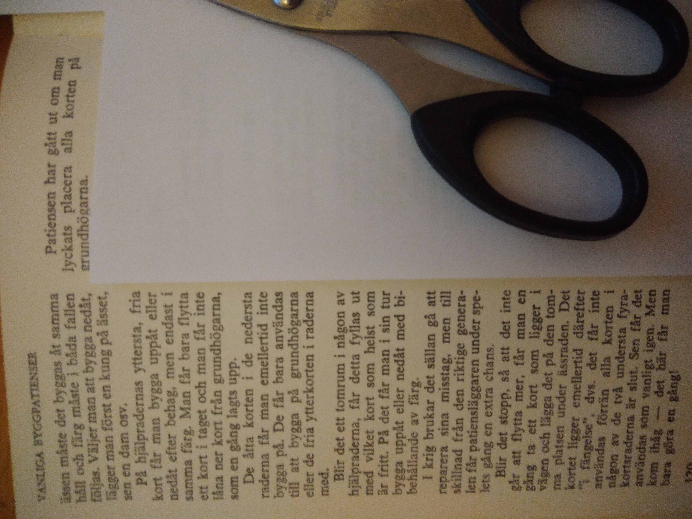
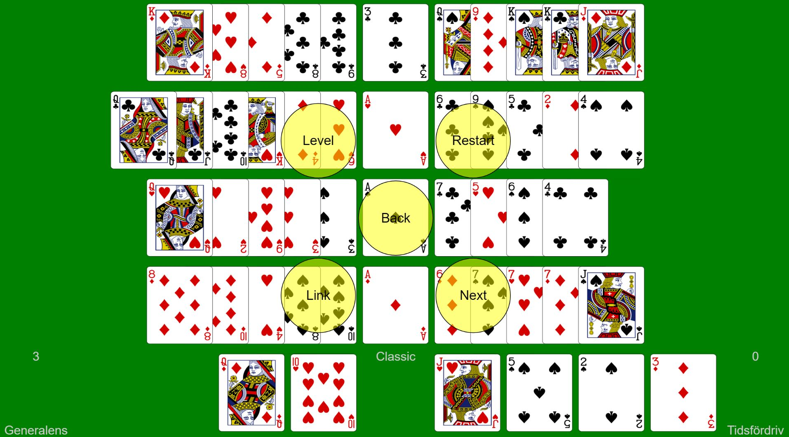
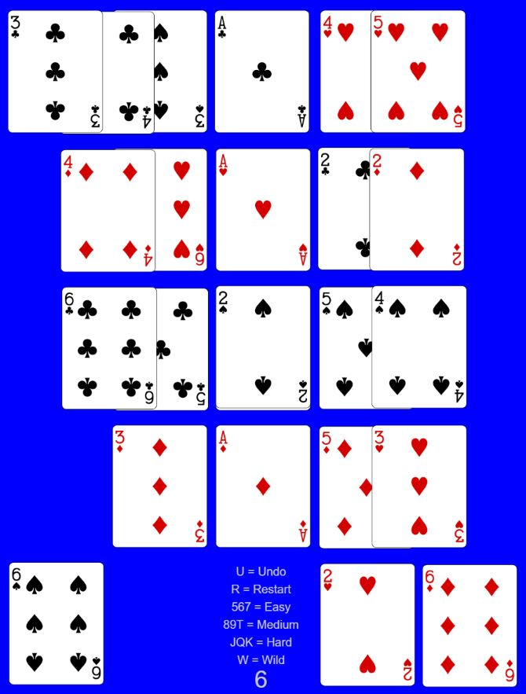

# Generalens Tidsfördriv

* Livet är kort!
* Det lär vara ett antal generaler som lägger denna patiens i fredstid för att hålla sina hjärnor i trim.
* Denna patiens går ut på att bygga uppåt på Essen. Dvs Tvåor läggs på Essen osv upp till Kung.
* På de övre åtta sekvenserna får man bygga både uppåt och neråt.
* Blir en sekvens tom får man placera valfritt kort där.
* De nedre åtta fria korten får man inte bygga på. Man får enbart plocka dessa.
* Färg bibehålles alltid. Det finns fyra färger.

# Menyn
Menyn nås genom att klicka på den gröna bakgrunden eller något av essen.

* [Undo] Ångrar senaste drag. Talet visar antalet drag som utförts. Draget indikeras med gult mynt och gul ring
* [Hint] Ger en ledtråd. Se röd/grön indikator. Talet visar antalet Hints som utförts
  * Prova även att göra en Restart innan du klickar på Hint. Då slipper du eventuella Undo.
* [Cycle Move] Ibland placeras korten på en annan plats än du tänkt dig. Med detta kommando kan du välja mellan alternativa platser. Klicka på mittcirkeln då du är nöjd.
* [More...]
  * [Restart] Återställ korten för denna Nivå.
  * [Total Restart] Innebär att starta om från Nivå 0. Alla Nivåer måste ånyo lösas
	* [Link] Sparar en länk till aktuell patiens till klippbordet
  * [Start/Exit Competition]
* [Next] Går till nästa nivå

# Nivåer 
Classic innebär att sekvenserna är lika långa.
Svårare nivåer kan nås genom att utföra så få drag som möjligt och utan att använda Hint.

* 0 = Classic Ess till 3. Lätt
* 1 = Ess till 4
* 2 = Ess till 5
* 3 = Classic Ess till 5
* 4 = Ess till 6
* 5 = Ess till 7
* 6 = Classic Ess till 7
* 7 = Ess till 8
* 8 = Ess till 9
* 9 = Classic Ess till 9
* 10 = Ess till Tio
* 11 = Ess till Knekt
* 12 = Classic Ess till Knekt
* 13 = Ess till Dam
* 14 = Ess till Kung
* 15 = Classic Ess till Kung. Svår

# Hints

* Klickar man på Hint får man ett förslag för att komma vidare mot lösningen
* Inledningsvis kan Hint ge en eller flera Undo som indikeras med rött
* Man måste själv utföra de föreslagna dragen
* Använder man Hint kan man inte avancera till nästa nivå

# Indikatorer

* [From] visar var draget börjar
* [To] visar var draget slutar
* Rött är en hint bakåt. Klicka på Undo för att utföra Undo
* Grönt är en hint framåt. Klicka på kortet för att utföra draget
* Gult visar vilken Undo som precis utförts. Du behöver ej klicka på något

# Lösbarhet

De skapade patienserna är alltid lösbara. Det är med andra ord alltid för tidigt att ge upp.

# Competition
Två eller flera personer.

## Tid
Börja med att bestämma en viss tid, t ex fem minuter eller en halv timma. Den som har hunnit längst har vunnit.
Ligger man lika fortsätter man tills någon når nästa nivå.

## Nivå
Bestäm antal nivåer som ska lösas, t ex 4, 8 eller 16. 

## Allmänt
Om man är smartare än datorn får man tillgodoräkna sig de dragen och använda dem på högre nivåer.

[Prova!](https://christernilsson.github.io/Lab/2018/056-GeneralensTidsf%C3%B6rdriv/index.html)

# Tips

* Maximera fönstret med F11
* Refresha med ctrl-R

# Litteratur

Att lägga patiens. Bokförlaget Forum 1957.
Motsvarar Nivå 15.

## Avvikelser från originalpatiensen

* Man måste bygga uppåt på essen.
* Man kan ej använda något fängelse.

