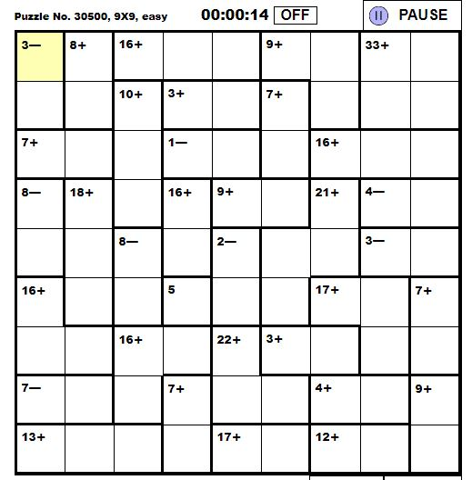

# KenKen

Populärt i SvD! Finns även på https://www.kenkenpuzzle.com

Pusslet går ut på att fylla i siffror i en matris så att inga dubletter förekommer på någon rad eller kolumn.

I en 4x4-matris får bara talen 1..4 förekomma.

Grupper av tal ska räknas ut.
T ex om N=4 så har man för ledtexten 7+ möjligheterna 3+4 och 4+3 om gruppstorleken är 2. 

Är gruppstorleken 3 finns fler möjligheter:
1+2+4 1+4+2 2+1+4 2+4+1 4+1+2 4+2+2
samt 1+3+3 3+1+3 3+3+1

Maximal gruppstorlek är fyra.

Möjliga pussel: 3x3 4x4 5x5 6x6 7x7 8x8 9x9

Lösningsmetod: Backtracking

9x9 tar cirka fem sekunder att lösa.