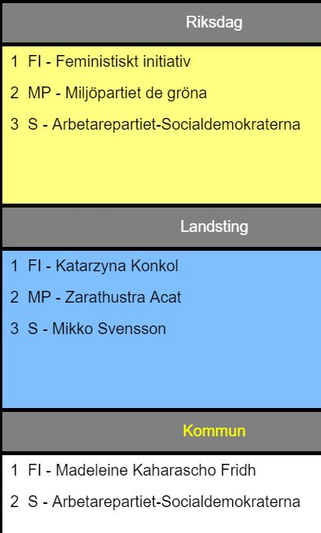

# Nytt valsystem

* Röster på små partier som inte kommer in i riksdagen blir ej bortkastade. Man kan göra andrahandsval, tredjehandsval, osv.
* Alla namnvalsedlar för hela Sverige tillgängliga. Man kan förtidsrösta på personer överallt.
* Personlig valsedel skrivs ut direkt i valbåset. Handskrivna valsedlar behövs ej längre.
* Den röstande kan skapa sin valsedel hemma i lugn och ro. Printas mha femställig kod i vallokalen.
* Utskriven QR-kod underlättar uträknande av valresultatet.

* Kommun anges i urlen.
  * T ex 010-Personval/index.html?kommun=1280
  * Stockholms kommun är default.

Partierna är sorterade fallande efter antalet kandidaturer.

# Exempel

Följande valsedel ska åstadkommas:

Klicka så här i 23 steg:

1. Riksdag
1. Fi
1. MP
1. S
1. Landsting
1. Fi
1. Katarzyna Konkol
1. MP
1. R-Z
1. Zarathustra Azal
1. S
1. M
1. M
1. Mikko Svensson
1. Kommun
1. Fi
1. Madeleine Kaharascho Fridh
1. S
1. Utskrift
1. Utskrift
1. Print
1. Fortsätt
1. Rensa

# Röstning på ett parti med Personval

Klicka så här i 15 steg:

1. Riksdag
1. Fi
1. L-Y
1. Yolanda Aurora Bohm Ramirez
1. Landsting
1. Fi
1. Katarzyna Konkol
1. Kommun
1. Fi
1. Madeleine Kaharascho Fridh
1. Utskrift
1. Utskrift
1. Print
1. Fortsätt
1. Rensa

# Röstning på ett parti utan Personval

Klicka så här i 11 steg:

1. Riksdag
1. Fi
1. Landsting
1. Fi
1. Kommun
1. Fi
1. Utskrift
1. Utskrift
1. Print
1. Fortsätt
1. Rensa

# Hjälp

* Byt - innebär att två rader byter plats
* x - innebär att raden tas bort
* Rensa - innebär att alla val tas bort
* A-Z - innebär att personer med förnamn som börjar på A-Z visas
* Två eller fler prickar - innebär att det finns fler sidor med namn. Klicka på knappen igen för att se övriga personer.

# Intern information

Att dela upp filen kandidaturer.js till riksdag/län/kommuner ger inte så mycket.
Riksdagsdelen är på 6.5 Mb och den måste alla läsa. Bedömd snittmängd cirka 10 Mb istf 28 Mb. 

Att ta bort kandidaturer som ställer upp i flera partier på samma nivå ger inte mycket.
Partierna finns kvar i alla fall.

https://github.com/davidshimjs/qrcodejs

# todo

* Kiosk mode.
* Bättre hantering av utskrift.
