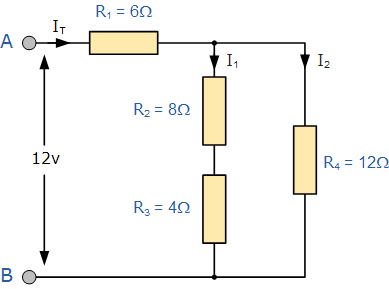
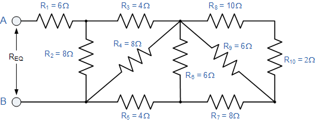

# Resistance Calculator in Nim

* Enter the resistor network using RPN
* s=serial
* p=parallel

## Smaller Example



### Input

```code
12 V
8 4 s 12 p 6 s
```

### Output

```code
       Ohm     Volt   Ampere     Watt
r    8.000    4.000    0.500    2.000
r    4.000    2.000    0.500    1.000
s   12.000    6.000    0.500    3.000
r   12.000    6.000    0.500    3.000
p    6.000    6.000    1.000    6.000
r    6.000    6.000    1.000    6.000
s   12.000   12.000    1.000   12.000
```

## Larger Example


### Input

```code
18 V
6 4 10 2 s 6 p 8 s 6 p 4 s 8 p s 8 p s
```

### Output

```code
       Ohm     Volt   Ampere     Watt
r    6.000   10.800    1.800   19.440
r    4.000    3.600    0.900    3.240
r   10.000    0.500    0.050    0.025
r    2.000    0.100    0.050    0.005
s   12.000    0.600    0.050    0.030
r    6.000    0.600    0.100    0.060
p    4.000    0.600    0.150    0.090
r    8.000    1.200    0.150    0.180
s   12.000    1.800    0.150    0.270
r    6.000    1.800    0.300    0.540
p    4.000    1.800    0.450    0.810
r    4.000    1.800    0.450    0.810
s    8.000    3.600    0.450    1.620
r    8.000    3.600    0.450    1.620
p    4.000    3.600    0.900    3.240
s    8.000    7.200    0.900    6.480
r    8.000    7.200    0.900    6.480
p    4.000    7.200    1.800   12.960
s   10.000   18.000    1.800   32.400
```