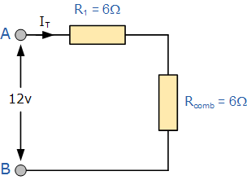
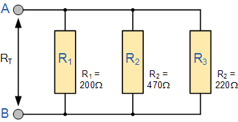
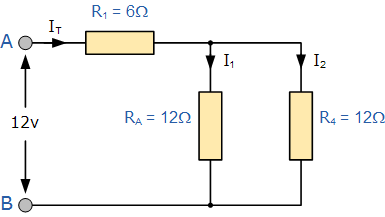
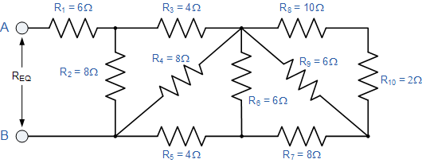

# Resistance Calculator

* Enter the resistor network using RPN, Reverse Polish Notation
* s = two serial resistors
* p = two parallel resistors

Resistance, Voltage, Current and Effect will be calculated for all resistors and groups of resistors.

## Example 1


### Input

```code
12 V
12
```

### Output

```code
     Ohm    Volt  Ampere    Watt  Network tree
  12.000  12.000   1.000  12.000  r
```

## Example 2


### Input

```code
12 V
6 6 s
```

### Output

The line below the header shows the total numbers and is the root of the tree.
Execution starts with the leaves, marked r for resistor.
The s line is the father of the r lines, but is actually produced after the sons.

```code
     Ohm    Volt  Ampere    Watt  Network tree
  12.000  12.000   1.000  12.000  s
   6.000   6.000   1.000   6.000  | r
   6.000   6.000   1.000   6.000  | r
```

## Example 3


### Input

```
12 V
200 470 220 p p
```

```200 470 p 220 p``` would produce the same result, but a different tree.

### Output
```code
     Ohm    Volt  Ampere    Watt  Network tree
  85.667  12.000   0.140   1.681  p
 149.855  12.000   0.080   0.961  | p
 220.000  12.000   0.055   0.655  | | r
 470.000  12.000   0.026   0.306  | | r
 200.000  12.000   0.060   0.720  | r
```

## Example 3B


### Input

```code
12 V
12 12 p 6 s
```
### Output
```code
     Ohm    Volt  Ampere    Watt  Network tree
  12.000  12.000   1.000  12.000  s
   6.000   6.000   1.000   6.000  | r
   6.000   6.000   1.000   6.000  | p
  12.000   6.000   0.500   3.000  | | r
  12.000   6.000   0.500   3.000  | | r
```

## Example 4


### Input

```code
12 V
8 4 s 12 p 6 s
```
### Output
```code
     Ohm    Volt  Ampere    Watt  Network tree
  12.000  12.000   1.000  12.000  s
   6.000   6.000   1.000   6.000  | r
   6.000   6.000   1.000   6.000  | p
  12.000   6.000   0.500   3.000  | | r
  12.000   6.000   0.500   3.000  | | s
   4.000   2.000   0.500   1.000  | | | r
   8.000   4.000   0.500   2.000  | | | r
```

## Example 5


### Input

```code
12 V
10 2 s 6 p 8 s 6 p 4 s 8 p 4 s 8 p 6 s
```

### Output

```code
     Ohm    Volt  Ampere    Watt  Network tree
  10.000  12.000   1.200  14.400  s
   6.000   7.200   1.200   8.640  | r
   4.000   4.800   1.200   5.760  | p
   8.000   4.800   0.600   2.880  | | r
   8.000   4.800   0.600   2.880  | | s
   4.000   2.400   0.600   1.440  | | | r
   4.000   2.400   0.600   1.440  | | | p
   8.000   2.400   0.300   0.720  | | | | r
   8.000   2.400   0.300   0.720  | | | | s
   4.000   1.200   0.300   0.360  | | | | | r
   4.000   1.200   0.300   0.360  | | | | | p
   6.000   1.200   0.200   0.240  | | | | | | r
  12.000   1.200   0.100   0.120  | | | | | | s
   8.000   0.800   0.100   0.080  | | | | | | | r
   4.000   0.400   0.100   0.040  | | | | | | | p
   6.000   0.400   0.067   0.027  | | | | | | | | r
  12.000   0.400   0.033   0.013  | | | | | | | | s
   2.000   0.067   0.033   0.002  | | | | | | | | | r
  10.000   0.333   0.033   0.011  | | | | | | | | | r
```

### Performance (Example 5)

```code
Nim infix     1.033 μs  nim cpp -d:release --opt:speed -r calc_infix.nim
Coffeescript  1.104 μs  calc.coffee
Nim static    1.250 μs
Nim dynamic   1.955 μs  nim cpp -d:release --opt:speed -r calc4.nim
C++ static    4.941 μs  c++ -O3 calc.cpp
C++ dynamic  10.866 μs  c++ -O3 calc2.cpp
Python infix 20.227 μs  python calc_infix.py
Python rpn   21.745 μs  python calc_rpn.py
```

* Quite remarkable that Coffeescript/Javascript is so fast.
* It has no type info and uses floats instead of integers.
* Coffeescript is faster, shorter and more object oriented than Nim.

### Nim

The OOP of Nim is quite rudimentary. Inheritance and Polymorphism is weak.
Nim is using both ```proc``` and ```method```. It is also necessary to use ```{.base.}``` for all methods in a base class.
Compare calc4.nim and calc.coffee to see the differences.
Although the parent class is stated, the concept of ```super``` does not exist in Nim.

On the plus side: typing really helps to spot thought errors.

### Python

Python is slow. It always uses dynamic typing and together with bignums this means slowness.
