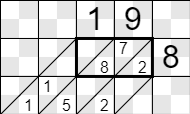
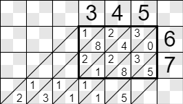
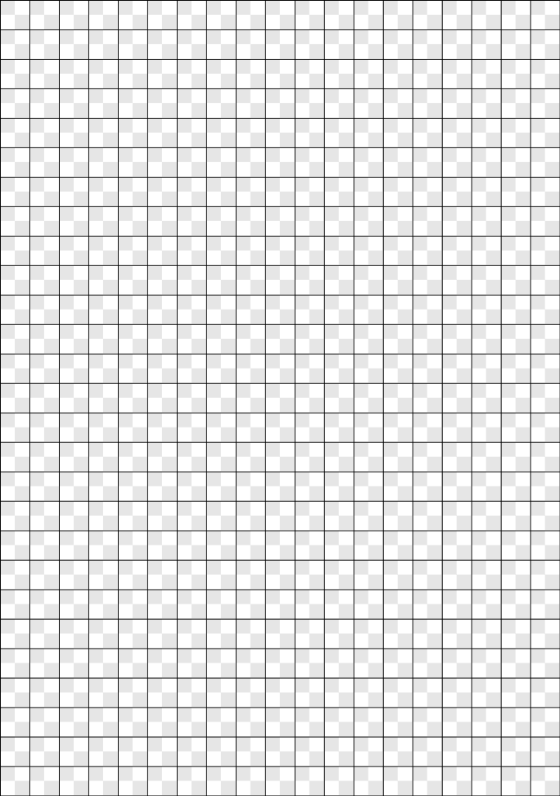

### Lattice Multiplication

* Draw the rectangle
* Draw the factors
* Calculate all digit * digit values inside the rectangle
* Tens goes to the upper left corner of each cell
* Ones goes to the lower right corner
* Sum the diagonals, start with lower right corner
* The bottom line will contain the result

#### Example 19 x 8

#### 19 x 8, step by step

* The rectangle is two cells wide, one cell high
* Draw 19
* Draw 8
* 1*8 = 8
* 9*8 = 72
* The last stripe is 2
* The middle stripe is 15
	* 1 goes to the next stripe as carry
	* 5 goes to this stripe
* The first stripe is 1
* The result of 19 x 8 is 80 + 72 = 152

### Example 345 x 67 = 23115

### Novelties

* I divide each cell into four subcells
* I put the carry digits in their proper positions

### Links

* [Youtube](https://www.youtube.com/watch?v=x2UG0YzT2UA)
* [Wikipedia](https://en.wikipedia.org/wiki/Lattice_multiplication)
* [Sheet for printing](lattice.bmp)
	* Download
	* Ctrl-p

### Sheet

### Extreme cases
For large numbers, like 1234567891234 x 1234567891234, some sums might be larger than 99. In these cases, the carry will be larger than 9.
The program supports sums up to 999 maximum.
