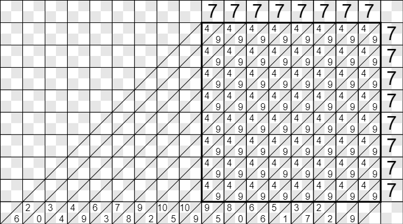

### Lattice Multiplication

#### Benefits

* Easier than long multiplication as it uses smaller steps
* Good training of the multiplication table
* Good training of writing readable digits
* Good algorithmic training
* Even young kids can multiply big numbers
* Easy handling of decimal numbers
* Similar methods can be used to multiply polynomials and complex numbers

#### Simple Steps

* Draw the rectangle
* Draw the multiplicands
* Calculate all digit * digit values inside the rectangle
* Tens goes to the upper left corner of each cell
* Ones goes to the lower right corner
* Sum the diagonals, start with lower right corner
* The bottom line will contain the result
* The line above the bottom line contains the carries

#### Example 19 x 8

#### 19 x 8, step by step

* The rectangle is two cells wide, one cell high
* Draw 19
* Draw 8
* 1*8 = 8
* 9*8 = 72
* The last diagonal is 2
* The middle diagonal is 7 + 8 = 15
	* 1 goes to the first diagonal as carry
	* 5 goes to the middle diagonal
* The first diagonal is 1
* The result of 19 x 8 is 80 + 72 = 152

### Example 345 x 67 = 23115

### Novelties

* I divide each cell into four subcells
* I put the carry digits in their proper positions

### Links

* [The Benefits of Lattice Multiplication](https://www.youtube.com/watch?v=8vai4uo6N5E)
* [Youtube](https://www.youtube.com/watch?v=x2UG0YzT2UA)
* [Wikipedia](https://en.wikipedia.org/wiki/Lattice_multiplication)
* [Background](https://prezi.com/qubrraxzdgqj/lattice-multiplication/)
* [Multiplying Polynomials](https://www.maa.org/sites/default/files/0746834254823.di020785.02p0462x.pdf)
* [Multiplying Complex Numbers](complex.PNG)
* [Sheet for printing](lattice.bmp)
	* Download
	* Ctrl-p

### Sheet

### Extreme cases
For large numbers, like 77777777 x 77777777, some diagonal sums might be larger than 99. In these cases, the carry will be larger than 9.
9 + 9 + 4 + 9 + 4 + 9 + 4 + 9 + 4 + 9 + 4 + 9 + 4 + 9 + 4 + 9 = 109

